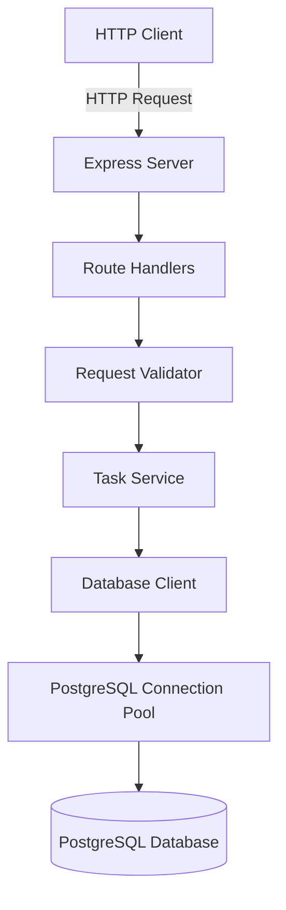

# Design Document: Local Node.js Demo Application

## Overview

The local Node.js demo application is a RESTful API service that provides task management functionality with PostgreSQL persistence. It serves as a test bed for the Cloud Mirror infrastructure, demonstrating database operations, health monitoring, and failover capabilities.

The application follows a three-tier architecture:
- **HTTP Layer**: Express.js server handling RESTful endpoints
- **Business Logic Layer**: Task management operations with validation
- **Data Layer**: PostgreSQL database with connection pooling

Key design principles:
- Simplicity: Minimal dependencies, straightforward implementation
- Observability: Structured logging for all operations
- Resilience: Health checks, retry logic, graceful shutdown
- Portability: Environment-based configuration, Docker support

## Architecture

### System Components



### Component Responsibilities

**Express Server** (`src/server.js`)
- Initialize HTTP server on configured port
- Register middleware (JSON parsing, logging)
- Mount route handlers
- Handle graceful shutdown signals

**Route Handlers** (`src/routes/`)
- Define API endpoints (tasks, health)
- Parse request parameters
- Invoke validators and services
- Format HTTP responses

**Request Validator** (`src/validators/taskValidator.js`)
- Validate JSON structure
- Check required fields (title)
- Validate field types and constraints
- Return descriptive error messages

**Task Service** (`src/services/taskService.js`)
- Implement business logic for CRUD operations
- Generate UUIDs for new tasks
- Set timestamps (created_at, updated_at)
- Handle default values (status: 'pending')

**Database Client** (`src/db/client.js`)
- Manage PostgreSQL connection pool
- Execute queries with retry logic
- Perform health checks
- Initialize schema on startup

**Configuration** (`src/config/index.js`)
- Load environment variables
- Provide defaults for optional settings
- Validate required configuration
- Export typed configuration object

**Logger** (`src/utils/logger.js`)
- Structured logging with timestamps
- Log levels: INFO, WARN, ERROR
- Request/response logging middleware
- Performance timing for operations

## Components and Interfaces

### HTTP API Endpoints

#### POST /tasks
Creates a new task.

**Request:**
```json
{
  "title": "string (required)",
  "description": "string (optional)",
  "status": "string (optional, default: 'pending')"
}
```

**Response (201):**
```json
{
  "id": "uuid",
  "title": "string",
  "description": "string",
  "status": "string",
  "created_at": "timestamp",
  "updated_at": "timestamp"
}
```

**Error Responses:**
- 400: Invalid JSON or missing required fields
- 500: Database error

#### GET /tasks
Retrieves all tasks.

**Response (200):**
```json
[
  {
    "id": "uuid",
    "title": "string",
    "description": "string",
    "status": "string",
    "created_at": "timestamp",
    "updated_at": "timestamp"
  }
]
```

**Error Responses:**
- 500: Database error

#### GET /tasks/:id
Retrieves a specific task by ID.

**Response (200):**
```json
{
  "id": "uuid",
  "title": "string",
  "description": "string",
  "status": "string",
  "created_at": "timestamp",
  "updated_at": "timestamp"
}
```

**Error Responses:**
- 404: Task not found
- 500: Database error

#### PUT /tasks/:id
Updates an existing task.

**Request:**
```json
{
  "title": "string (optional)",
  "description": "string (optional)",
  "status": "string (optional)"
}
```

**Response (200):**
```json
{
  "id": "uuid",
  "title": "string",
  "description": "string",
  "status": "string",
  "created_at": "timestamp",
  "updated_at": "timestamp"
}
```

**Error Responses:**
- 400: Invalid JSON
- 404: Task not found
- 500: Database error

#### DELETE /tasks/:id
Deletes a task.

**Response (204):**
No content

**Error Responses:**
- 500: Database error

#### GET /health
Reports application and database health status.

**Response (200):**
```json
{
  "status": "healthy",
  "database": "connected"
}
```

**Response (503):**
```json
{
  "status": "unhealthy",
  "database": "disconnected"
}
```

### Internal Interfaces

#### Database Client Interface

```javascript
class DatabaseClient {
  async connect()
  async disconnect()
  async query(sql, params)
  async healthCheck()
  async initializeSchema()
}
```

#### Task Service Interface

```javascript
class TaskService {
  async createTask(taskData)
  async getAllTasks()
  async getTaskById(id)
  async updateTask(id, updates)
  async deleteTask(id)
}
```

#### Validator Interface

```javascript
function validateTaskCreate(body)
function validateTaskUpdate(body)
// Returns: { valid: boolean, errors: string[] }
```

## Data Models

### Task Entity

**Database Table: tasks**

| Column | Type | Constraints | Description |
|--------|------|-------------|-------------|
| id | UUID | PRIMARY KEY | Unique task identifier |
| title | TEXT | NOT NULL | Task title |
| description | TEXT | NULL | Task description |
| status | TEXT | NOT NULL, DEFAULT 'pending' | Task status |
| created_at | TIMESTAMP | NOT NULL, DEFAULT NOW() | Creation timestamp |
| updated_at | TIMESTAMP | NOT NULL, DEFAULT NOW() | Last update timestamp |

**Indexes:**
- PRIMARY KEY on id
- INDEX on status for filtering queries

**Schema DDL:**
```sql
CREATE TABLE IF NOT EXISTS tasks (
  id UUID PRIMARY KEY,
  title TEXT NOT NULL,
  description TEXT,
  status TEXT NOT NULL DEFAULT 'pending',
  created_at TIMESTAMP NOT NULL DEFAULT NOW(),
  updated_at TIMESTAMP NOT NULL DEFAULT NOW()
);

CREATE INDEX IF NOT EXISTS idx_tasks_status ON tasks(status);
```

### Configuration Model

```javascript
{
  port: number,              // HTTP server port (default: 3000)
  db: {
    host: string,            // PostgreSQL host (default: 'localhost')
    port: number,            // PostgreSQL port (default: 5432)
    database: string,        // Database name (default: 'demo_app')
    user: string,            // Database user (default: 'postgres')
    password: string,        // Database password (required)
    min: number,             // Min pool connections (default: 2)
    max: number              // Max pool connections (default: 10)
  },
  shutdown: {
    timeout: number          // Graceful shutdown timeout ms (default: 10000)
  }
}
```

### Log Entry Model

```javascript
{
  timestamp: string,         // ISO 8601 timestamp
  level: string,             // 'INFO' | 'WARN' | 'ERROR'
  message: string,           // Log message
  context: object            // Additional context (optional)
}
```


## Correctness Properties

*A property is a characteristic or behavior that should hold true across all valid executions of a system—essentially, a formal statement about what the system should do. Properties serve as the bridge between human-readable specifications and machine-verifiable correctness guarantees.*

### Property 1: Task Creation Round Trip

*For any* valid task data (with non-empty title), creating a task via POST /tasks and then retrieving it via GET /tasks/:id should return a task with the same title, description, and status values.

**Validates: Requirements 4.1, 4.3**

### Property 2: Task List Completeness

*For any* sequence of task creation operations, GET /tasks should return all created tasks with no duplicates or omissions.

**Validates: Requirements 4.2**

### Property 3: Task Update Persistence

*For any* existing task and valid update data, updating the task via PUT /tasks/:id and then retrieving it should return the task with the updated values and a newer updated_at timestamp.

**Validates: Requirements 4.5**

### Property 4: Task Deletion Removes Task

*For any* existing task, deleting it via DELETE /tasks/:id should result in subsequent GET /tasks/:id requests returning HTTP status 404.

**Validates: Requirements 4.6**

### Property 5: Non-Existent Task Returns 404

*For any* UUID that does not correspond to an existing task, GET /tasks/:id should return HTTP status 404.

**Validates: Requirements 4.4**

### Property 6: Invalid JSON Rejected

*For any* request body that is not valid JSON, POST or PUT requests to /tasks should return HTTP status 400 with an error message indicating invalid JSON.

**Validates: Requirements 6.1, 6.2**

### Property 7: Required Field Validation

*For any* task creation request where the title field is missing, empty, or not a string, the API should return HTTP status 400 with a descriptive error message.

**Validates: Requirements 6.3, 6.4**

### Property 8: Optional Fields Use Defaults

*For any* task creation request that omits optional fields (description, status), the created task should have default values (description: null or empty, status: 'pending').

**Validates: Requirements 6.5**

### Property 9: Database Errors Return 500

*For any* task operation (create, read, update, delete) that encounters a database error, the API should return HTTP status 500 with an error message.

**Validates: Requirements 4.7**

### Property 10: Configuration Loading with Defaults

*For any* set of environment variables (including missing variables), the application should load configuration using provided values where available and documented defaults for missing optional values.

**Validates: Requirements 7.1, 7.2**

### Property 11: Configuration Logging Excludes Password

*For any* configuration loaded at startup, all configuration values should be logged except DB_PASSWORD.

**Validates: Requirements 7.4**

### Property 12: Request Logging Completeness

*For any* HTTP request received by the server, a log entry should be created containing the request method, path, status code, and response time.

**Validates: Requirements 1.2, 9.4**

### Property 13: Database Operation Logging

*For any* database operation that completes (successfully or with error), a log entry should be created containing the operation type and execution time.

**Validates: Requirements 9.2**

### Property 14: Error Logging Includes Stack Trace

*For any* error that occurs during request processing, a log entry should be created containing the error message and stack trace.

**Validates: Requirements 9.3**

### Property 15: Log Entry Format

*For any* log message generated by the application, it should include a timestamp, level (INFO, WARN, ERROR), and message text.

**Validates: Requirements 9.1**

### Property 16: Health Check Response Time

*For any* health check request to GET /health, the response should be returned within 5 seconds.

**Validates: Requirements 2.4**

### Property 17: Query Retry with Exponential Backoff

*For any* database query that fails transiently, the database client should retry the query up to 3 times with exponentially increasing delays between attempts.

**Validates: Requirements 3.5**

### Property 18: Graceful Shutdown Stops New Connections

*For any* SIGTERM or SIGINT signal received by the application, the server should stop accepting new HTTP connections immediately.

**Validates: Requirements 8.1**

### Property 19: Graceful Shutdown Waits for In-Flight Requests

*For any* in-flight HTTP requests when shutdown is initiated, the server should wait up to 10 seconds for them to complete before forcing shutdown.

**Validates: Requirements 8.2**

### Property 20: Shutdown Closes Database Connections

*For any* shutdown sequence (graceful or forced), all database connections in the connection pool should be closed before the application exits.

**Validates: Requirements 8.3**

## Error Handling

### Error Categories

**Client Errors (4xx)**
- 400 Bad Request: Invalid JSON, missing required fields, invalid field types
- 404 Not Found: Task ID does not exist

**Server Errors (5xx)**
- 500 Internal Server Error: Database connection failures, query errors, unexpected exceptions
- 503 Service Unavailable: Health check fails (database unreachable)

### Error Response Format

All error responses follow a consistent JSON structure:

```json
{
  "error": "Error message describing what went wrong",
  "details": "Additional context (optional)"
}
```

### Error Handling Strategy

**Validation Errors**
- Validate input before database operations
- Return 400 with descriptive messages
- Log validation failures at INFO level

**Database Errors**
- Retry transient failures (connection timeouts, deadlocks) up to 3 times
- Use exponential backoff: 100ms, 200ms, 400ms
- Log all database errors at ERROR level with stack traces
- Return 500 to client after exhausting retries

**Startup Errors**
- Database connection failure: Log error and exit with code 1
- Schema initialization failure: Log error and exit with code 1
- Port already in use: Log error and exit with code 1
- Missing required configuration: Log error and exit with code 1

**Runtime Errors**
- Uncaught exceptions: Log with stack trace, attempt graceful shutdown
- Unhandled promise rejections: Log with stack trace, continue operation
- Health check failures: Return 503, log at WARN level

**Shutdown Errors**
- Connection pool close failure: Log at WARN level, continue shutdown
- Timeout during graceful shutdown: Force exit with code 0

### Retry Logic

Database operations implement retry logic for transient failures:

```javascript
async function queryWithRetry(sql, params, maxRetries = 3) {
  for (let attempt = 1; attempt <= maxRetries; attempt++) {
    try {
      return await pool.query(sql, params);
    } catch (error) {
      if (attempt === maxRetries || !isTransientError(error)) {
        throw error;
      }
      const delay = 100 * Math.pow(2, attempt - 1);
      await sleep(delay);
    }
  }
}
```

Transient errors include:
- Connection timeouts
- Connection refused (during startup)
- Deadlock detected
- Too many connections

## Testing Strategy

### Dual Testing Approach

The application requires both unit tests and property-based tests for comprehensive coverage:

**Unit Tests** verify specific examples, edge cases, and integration points:
- Specific task creation with known values
- Health endpoint responses (healthy/unhealthy states)
- Schema initialization on first run
- Graceful shutdown sequence
- Docker container startup
- Configuration loading with specific environment variables
- Error conditions (port in use, database unavailable at startup)

**Property-Based Tests** verify universal properties across all inputs:
- Task CRUD operations with randomly generated task data
- Validation behavior with randomly generated invalid inputs
- Logging behavior across random request patterns
- Configuration loading with random environment variable combinations
- Retry logic with simulated random failures

### Property-Based Testing Configuration

**Library**: Use `fast-check` for Node.js property-based testing

**Test Configuration**:
- Minimum 100 iterations per property test
- Each test tagged with reference to design document property
- Tag format: `// Feature: local-node-demo-app, Property {number}: {property_text}`

**Example Property Test Structure**:

```javascript
const fc = require('fast-check');

// Feature: local-node-demo-app, Property 1: Task Creation Round Trip
test('creating and retrieving a task returns the same data', async () => {
  await fc.assert(
    fc.asyncProperty(
      fc.record({
        title: fc.string({ minLength: 1 }),
        description: fc.option(fc.string()),
        status: fc.option(fc.constantFrom('pending', 'in-progress', 'completed'))
      }),
      async (taskData) => {
        const created = await createTask(taskData);
        const retrieved = await getTaskById(created.id);
        
        expect(retrieved.title).toBe(taskData.title);
        expect(retrieved.description).toBe(taskData.description || null);
        expect(retrieved.status).toBe(taskData.status || 'pending');
      }
    ),
    { numRuns: 100 }
  );
});
```

### Test Organization

```
tests/
├── unit/
│   ├── server.test.js           # Server startup, shutdown
│   ├── routes/
│   │   ├── tasks.test.js        # Task endpoint examples
│   │   └── health.test.js       # Health endpoint examples
│   ├── services/
│   │   └── taskService.test.js  # Business logic examples
│   ├── db/
│   │   └── client.test.js       # Database client examples
│   └── validators/
│       └── taskValidator.test.js # Validation examples
├── property/
│   ├── taskCrud.property.test.js      # Properties 1-5, 9
│   ├── validation.property.test.js     # Properties 6-8
│   ├── configuration.property.test.js  # Properties 10-11
│   ├── logging.property.test.js        # Properties 12-15
│   ├── resilience.property.test.js     # Properties 16-17
│   └── shutdown.property.test.js       # Properties 18-20
└── integration/
    ├── docker.test.js           # Docker build and compose
    └── endToEnd.test.js         # Full application flow
```

### Testing Guidelines

**Unit Test Focus**:
- One specific scenario per test
- Clear test names describing the scenario
- Minimal setup and teardown
- Fast execution (mock database when appropriate)

**Property Test Focus**:
- Generate diverse random inputs
- Test universal properties that should always hold
- Use realistic data generators (valid UUIDs, reasonable string lengths)
- Clean up test data between iterations

**Integration Test Focus**:
- Test component interactions
- Use real database (test database or Docker container)
- Verify Docker builds and container startup
- Test complete request/response cycles

**Test Data Management**:
- Use transactions for database tests (rollback after each test)
- Generate unique task IDs to avoid conflicts
- Clean up test data in teardown hooks
- Use separate test database (demo_app_test)

### Continuous Testing

**Pre-commit**: Run unit tests and linting
**CI Pipeline**: Run all tests (unit, property, integration)
**Docker Tests**: Verify Dockerfile builds and docker-compose starts successfully

